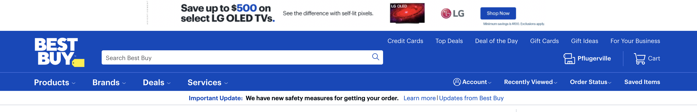
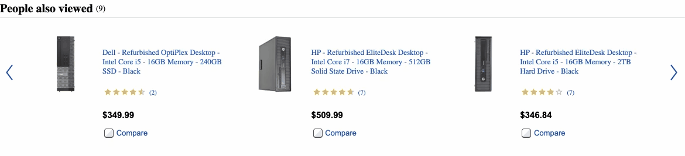
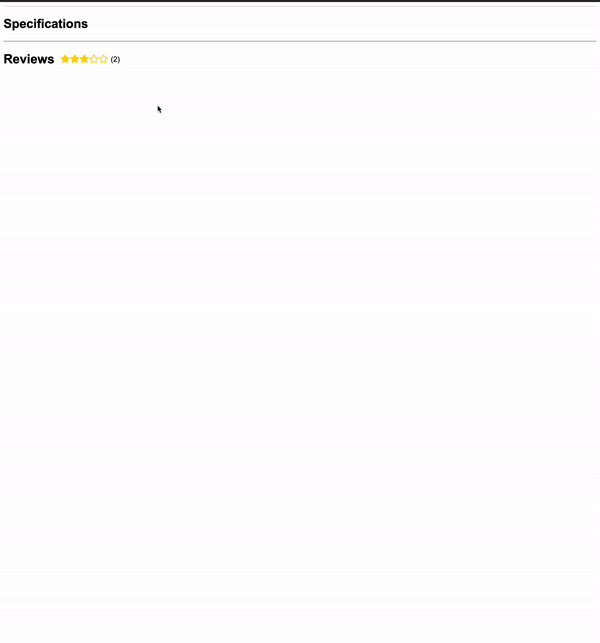

FEC, Front End Capstone

This is the reverse proxy server I built for my front end capstone project at hack reactor.  I lead a team of 3 other software engineers over the course of this 3 week project.  Our task was to replicate the Best Buy product page both asthetically and functionally.  

Technology used:

    React, Hooks, JQuery
    Node, Express, Axios
    Material UI
    AWS S3, AWS Elastic Beanstalk, AWS RDS, AWS E2
    Trello

Joshua Edwards, https://github.com/orgs/HRATX49-BestBuy/people/Kptkrunch

Benjamin Polancich, https://github.com/orgs/HRATX49-BestBuy/people/PolancichBen

Ricardo Guerrero, https://github.com/orgs/HRATX49-BestBuy/people/richigro

Chris Murray, https://github.com/orgs/HRATX49-BestBuy/people/cmurray1105

Navbar:
This was the component created by Ricardo Guerrero.

Product Display:
This component was completed by Chris Murray

Carousel:
Joshua Edwards created this component

Carousel2: 
Joshua Edwards created this component

Reviews: 
Benjamin Polancich

Footer:
Joshua Edwards created this component
